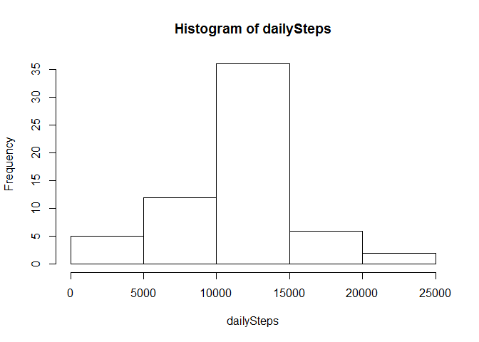

# Reproducible Research: Peer Assessment 1


## Loading and preprocessing the data

```r
unzip('activity.zip')
activity <- read.csv("activity.csv")
head(activity)
```

```
##   steps       date interval
## 1    NA 2012-10-01        0
## 2    NA 2012-10-01        5
## 3    NA 2012-10-01       10
## 4    NA 2012-10-01       15
## 5    NA 2012-10-01       20
## 6    NA 2012-10-01       25
```


## What is mean total number of steps taken per day?
### Calculate total steps per day 

```r
stepsPerDay <- tapply(activity$steps, activity$date, sum, na.rm=TRUE)
```

### Plot them in a histogram

```r
hist(stepsPerDay)
```

<!-- -->

### Get mean

```r
mean(stepsPerDay)
```

```
## [1] 9354.23
```

## What is the average daily activity pattern?
### Create a time series plot

```r
avgDaily <- aggregate(x=list(avgSteps=activity$steps), by=list(interval=activity$interval), FUN=mean, na.rm=TRUE)
head(avgDaily)
```

```
##   interval  avgSteps
## 1        0 1.7169811
## 2        5 0.3396226
## 3       10 0.1320755
## 4       15 0.1509434
## 5       20 0.0754717
## 6       25 2.0943396
```

```r
plot(avgDaily, type="l")
```

<!-- -->

### Get max steps

```r
rowOfMax <- which.max(avgDaily$avgSteps)
rowOfMax
```

```
## [1] 104
```

```r
maxInterval <-  gsub("([0-9]{1,2})([0-9]{2})", "\\1:\\2", avgDaily[rowOfMax,'interval'])
maxInterval
```

```
## [1] "8:35"
```


## Imputing missing values
### Count missing values

```r
length(which(is.na(activity)))
```

```
## [1] 2304
```

### Strategy for replacing missing values
Replace NAs with mean.

### New dataset with filled missing values

```r
activityFilled <- activity
activityFilled[is.na(activityFilled[,1]), 1] <- mean(activityFilled[,1], na.rm = TRUE)

head(activityFilled)
```

```
##     steps       date interval
## 1 37.3826 2012-10-01        0
## 2 37.3826 2012-10-01        5
## 3 37.3826 2012-10-01       10
## 4 37.3826 2012-10-01       15
## 5 37.3826 2012-10-01       20
## 6 37.3826 2012-10-01       25
```

### Histogram of daily steps (plus mean and median)

```r
dailySteps <- tapply(activityFilled$steps, activityFilled$date, sum)
hist(dailySteps)
```

<!-- -->

```r
mean(dailySteps)
```

```
## [1] 10766.19
```

```r
median(dailySteps)
```

```
## [1] 10766.19
```


## Are there differences in activity patterns between weekdays and weekends?
### Create weekday, weekend variable

```r
activityFilled$dayType <-  ifelse(as.POSIXlt(activityFilled$date)$wday %in% c(0,6), 'weekend', 'weekday')
```

### Panel plot with times series plot for intervals and average steps across weekdays and weekends

```r
avgStepsInWeek <- aggregate(steps ~ interval + dayType, data=activityFilled, mean)

library(ggplot2)
ggplot(avgStepsInWeek, aes(interval, steps)) +      
  geom_line() + 
  facet_grid(dayType ~ .) 
```

<!-- -->


